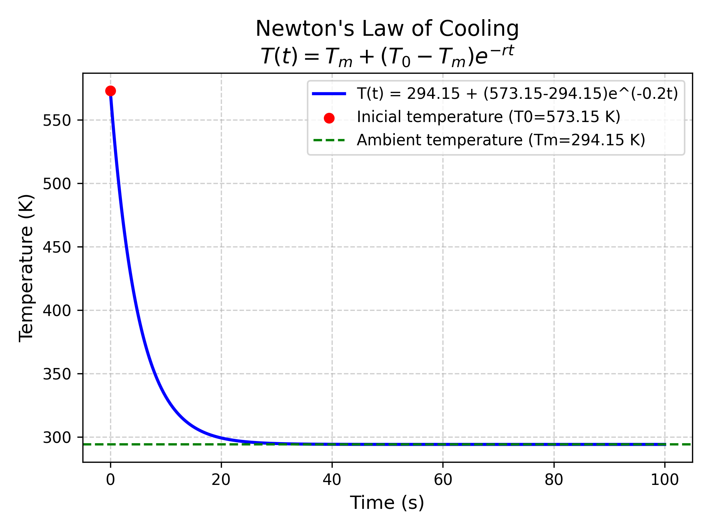

# Newton's Law of Cooling - Computational Simulation

[](https://www.python.org/)
[](LICENSE)

A Python simulation of Newton's law of cooling, comparing theoretical model with experimental data (in progress). Includes interactive temperature plots and parameter analysis.

## Table of Contents
- [Installation](#installation)
- [Usage](#usage)
- [Theory](#theory)
- [Results](#results)
- [Next Steps](#nextspteps)
- [Project Structure](#project-structure)
- [License](#license)

## Installation
1. Clone the repository:
   
```bash
git clone https://github.com/TheMelladator/Physics_Newton_Cooling_Law.git
cd Physics_Newton_Cooling_Law
```

2. Install dependencies:
   
```bash
pip install numpy matplotlib jupyterlab
```

## Usage
Run the simulation in Jupyter Notebook:

```bash
jupyter notebook src/Newton_cooling.ipynb
```
    
You'll be prompted to enter:
- Ambient temperature (`Tm`) in Kelvin
- Initial object temperature (`T0`) in Kelvin
- Cooling coefficient (`r`) in 1/second
    
Example:

```python
Tm = 294.15 #21°C
T0 = 573.15 #300°C
r = 0.2
```

## Theory
The differential equation modeled is:

```markdown
$$
\frac{dT}{dt}=-r(T-T_{environment})
$$
```

With analytical solution:

```markdown
$$
T(t)=T_m+(T_0-T_m)e^{-rt}
$$
```

## Results

*Figure 1*: Temperature decay with `T0` = 300°, `Tm` = 21°C, `r` = 0.2 

## Project Structure

```markdown
/Physics_Newton_Cooling_Law/
├── src/
│   └── Newton_cooling.ipynb  # Main simulation notebook
├── data/                     #Experimental/simulated data (in progress)
├── figures/                  #Generated plots
│   └── newton_cooling.png     
├── LICENSE
└── README.md                 # This file
```

## Next Steps
- [] Add experimental data validation.
- [] Implement parameter optimization.
- [] Animated experimet.
  
## License
Distributed under MIT License